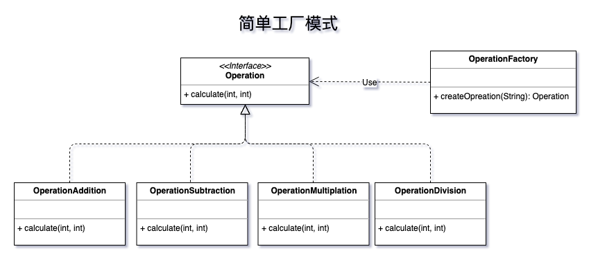

## 场景

本例利用**简单工厂模式**实现加、减、乘、除计算功能：

1. 定义计算操作接口（Operation），接口中定义计算方法（calculate）
2. 定义加、减、乘、除计算操作实现类，实现计算接口，实现计算方法（calculate）
3. 定义操作工厂类，提供创建操作类型的方法，返回 Operation 
4. 调用者利用工厂类获取 Operation ，进行计算处理

> *以上几步可以把调用者和具体实现操作隔离开来，调用者不必清楚具体计算如何实现，只需传入指令操作，获取对应操作类，调用计算方法即可完成计算功能。*

## UML


## Code by Java
```java
/**
 * 计算操作接口
 *
 * @author jw
 */
public interface Operation {
    int calculate(int firstNum, int secondNum) throws IllegalArgumentException;
}
```

```java
/**
 * 加法操作实现类
 *
 * @author jw
 */
public class OperationAddition implements Operation {
    @Override
    public int calculate(int firstNum, int secondNum) throws IllegalArgumentException {
        return firstNum + secondNum;
    }
}
```

```java
/**
 * 减法操作实现类
 *
 * @author jw
 */
public class OperationSubtraction implements Operation {
    @Override
    public int calculate(int firstNum, int secondNum) throws IllegalArgumentException {
        return firstNum - secondNum;
    }
}
```

```java
/**
 * 乘法操作实现类
 *
 * @author jw
 */
public class OperationMultiplication implements Operation {
    @Override
    public int calculate(int firstNum, int secondNum) throws IllegalArgumentException {
        return firstNum * secondNum;
    }
}
```

```java
/**
 * 除法操作实现类
 *
 * @author jw
 */
public class OperationDivision implements Operation {
    @Override
    public int calculate(int firstNum, int secondNum) throws IllegalArgumentException {
        if(secondNum == 0){
            throw new IllegalArgumentException("除数不能为0");
        }
        return firstNum / secondNum;
    }
}
```

```java
/**
 * 计算操作工厂类
 *
 * @author jw
 */
public class OperationFactory {

    public static Operation createOperation(String operation){
        switch(operation){
            case "+":
                return new OperationAddition();
            case "-":
                return new OperationSubtraction();
            case "*":
                return new OperationMultiplication();
            case "/":
                return new OperationDivision();
            default:
                return null;
        }
    }
}
```

```java
/**
 * 应用
 *
 * @author jw
 */
public class TwoNumberCalculator {
    private int firstNum;
    private int secondNum;
    private Operation operation;


    public TwoNumberCalculator(){}

    public TwoNumberCalculator(int firstNum, int secondNum, Operation operation){
        this.firstNum = firstNum;
        this.secondNum = secondNum;
        this.operation = operation;
    }

    public int calculateResult(){
        return operation.calculate(firstNum, secondNum);
    }

    /* getter and setter */
    		
    public static void main(String[] arg){
        TwoNumberCalculator calculator = new TwoNumberCalculator(3, 4,
                OperationFactory.createOperation("+"));
        // The calculate result is 7
        System.out.println("The calculate result is " + calculator.calculateResult());
    }
}
```
